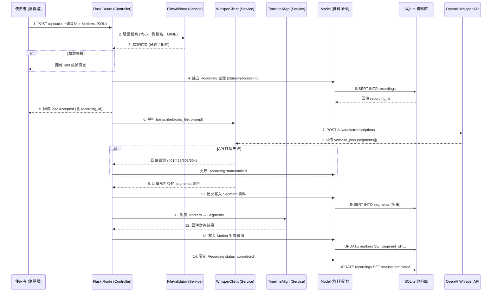
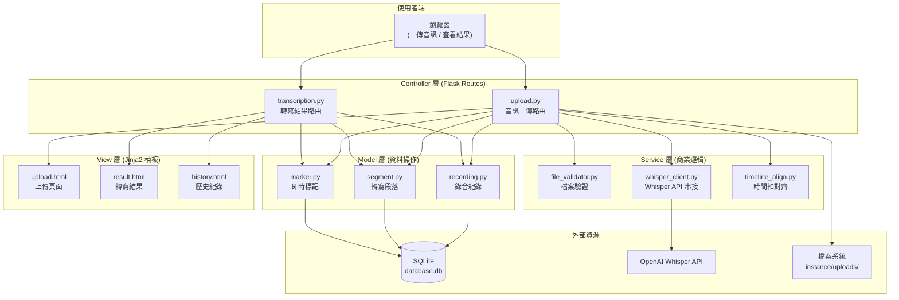

# 系統架構設計文件：語音轉寫與 API 整合系統

## 1. 技術架構說明

本專案為「即時標記與語音辨識錄音工具」的後端子系統，負責音訊上傳、Whisper API 串接、轉寫結果儲存與時間軸對齊。採用 Python 輕量級網頁框架，並整合外部 AI 語音辨識服務。

### 選用技術與原因

- **後端框架：Python + Flask**
  - **原因**：Flask 輕量且彈性高，適合快速建構 RESTful 上傳端點與頁面渲染。其豐富的擴充生態系（如 `python-dotenv`、`requests`）能輕鬆整合外部 API，學習曲線平緩，非常適合團隊協作開發。

- **模板引擎：Jinja2**
  - **原因**：與 Flask 深度整合，可直接將轉寫結果、時間軸資料嵌入 HTML 頁面渲染。內建自動轉義功能可防護 XSS 攻擊，讓前端呈現安全且直覺。

- **資料庫：SQLite**
  - **原因**：零設定、單一檔案，適合 MVP 階段快速開發。用於儲存錄音紀錄、轉寫逐字稿、時間戳段落與即時標記資料，效能足以應付中小規模的使用場景。

- **外部 API：OpenAI Whisper API**
  - **原因**：OpenAI 提供的雲端語音辨識服務（`whisper-1` 模型），支援多語言與多種音訊格式，透過 `verbose_json` 回傳格式可取得逐句時間戳，適合需要時間軸對齊的應用場景。

- **環境變數管理：python-dotenv**
  - **原因**：將 API 金鑰等機敏資訊存放於 `.env` 檔案，避免寫死在程式碼中，兼顧安全性與開發便利性。

### Flask MVC 模式說明

本專案依循 MVC（Model-View-Controller）的概念組織程式碼，並額外引入 **Service 層** 來封裝與外部 API 的互動邏輯：

- **Model（模型層）**：負責定義資料結構與 SQLite 資料庫操作，包含「錄音紀錄 (Recording)」、「轉寫段落 (Segment)」、「即時標記 (Marker)」等資料表的 CRUD 方法。
- **View（視圖層）**：由 Jinja2 模板擔任，負責渲染轉寫結果頁面、歷史紀錄列表等 HTML 介面。
- **Controller（控制器層）**：由 Flask 路由（Routes）擔任，負責接收前端的上傳請求、呼叫 Service 層進行 API 串接、將結果透過 Model 寫入資料庫、最後將資料傳遞給 View 渲染。
- **Service（服務層）**：封裝與 OpenAI Whisper API 的串接邏輯，包含檔案驗證、API 呼叫、回應解析、錯誤處理等。將外部 API 的互動邏輯從 Controller 中抽離，提高可測試性與可維護性。

```
┌─────────────────────────────────────────────────────────┐
│                    使用者瀏覽器                            │
│          (上傳音訊 / 查看轉寫結果 / 瀏覽標記)               │
└──────────────────────┬──────────────────────────────────┘
                       │ HTTP Request
                       ▼
┌─────────────────────────────────────────────────────────┐
│              Flask Route (Controller)                   │
│     接收上傳請求 → 呼叫 Service → 調用 Model → 渲染 View  │
└──────┬──────────────────┬───────────────────┬───────────┘
       │                  │                   │
       ▼                  ▼                   ▼
┌─────────────┐  ┌─────────────────┐  ┌──────────────────┐
│   Service   │  │  Model (資料層)  │  │ Jinja2 Template  │
│ Whisper API │  │  SQLite CRUD    │  │    (View)        │
│  串接與解析  │  │  錄音/段落/標記  │  │  結果頁面渲染     │
└──────┬──────┘  └────────┬────────┘  └──────────────────┘
       │                  │
       ▼                  ▼
┌─────────────┐  ┌─────────────────┐
│ OpenAI API  │  │  SQLite 資料庫   │
│ (whisper-1) │  │ (database.db)   │
└─────────────┘  └─────────────────┘
```

---

## 2. 專案資料夾結構

以下是本專案的完整資料夾結構與各檔案職責說明：

```text
web_app_development/
├── app/                        # 應用程式主目錄
│   ├── __init__.py             # 初始化 Flask 應用程式、註冊 Blueprint、載入設定
│   ├── models/                 # (Model) 資料庫模型定義與操作
│   │   ├── __init__.py
│   │   ├── recording.py        # 錄音紀錄資料表操作 (CRUD)
│   │   ├── segment.py          # 轉寫段落資料表操作 (每句文字 + start/end 時間)
│   │   └── marker.py           # 即時標記資料表操作 (標記時間點 + 對齊段落)
│   ├── routes/                 # (Controller) Flask 路由處理邏輯
│   │   ├── __init__.py
│   │   ├── upload.py           # 音訊上傳路由：接收檔案、驗證、觸發轉寫
│   │   └── transcription.py    # 轉寫結果路由：查看逐字稿、歷史紀錄
│   ├── services/               # (Service) 外部 API 串接與商業邏輯
│   │   ├── __init__.py
│   │   ├── whisper_client.py   # Whisper API 呼叫封裝 (含在地化 prompt)
│   │   ├── file_validator.py   # 檔案驗證邏輯 (大小、副檔名、MIME Type)
│   │   └── timeline_align.py   # 時間軸對齊邏輯 (Marker ↔ Segment 配對)
│   ├── templates/              # (View) Jinja2 HTML 頁面模板
│   │   ├── base.html           # 共用版型 (標題列、導覽列、CSS/JS 引入)
│   │   └── transcriptions/     # 轉寫相關頁面
│   │       ├── upload.html     # 音訊上傳頁面 (含進度指示)
│   │       ├── result.html     # 單筆轉寫結果頁面 (逐字稿 + 時間軸 + 標記)
│   │       └── history.html    # 轉寫歷史紀錄列表頁面
│   └── static/                 # CSS、JS、圖片等靜態資源
│       ├── css/
│       │   └── style.css       # 主要樣式表
│       └── js/
│           └── upload.js       # 前端上傳互動邏輯 (進度條、狀態輪詢)
├── instance/                   # 存放本地端變動性資料 (不進版控)
│   ├── database.db             # SQLite 資料庫檔案
│   └── uploads/                # 暫存上傳的音訊檔案
├── docs/                       # 專案設計文件
│   ├── PRD.md                  # 產品需求文件
│   └── ARCHITECTURE.md         # 系統架構文件 (本文件)
├── .env                        # 環境變數 (API 金鑰等，不進版控)
├── .gitignore                  # Git 忽略規則
├── requirements.txt            # Python 依賴套件清單
└── app.py                      # 應用程式啟動入口
```

### 各資料夾職責詳解

| 資料夾/檔案 | 職責說明 |
|---|---|
| `app/__init__.py` | 建立 Flask app 實例、載入 `.env` 設定、註冊各 Blueprint、初始化資料庫連線 |
| `app/models/` | 定義三個核心資料表（Recording、Segment、Marker）的 Python 操作函式，封裝所有 SQL 查詢 |
| `app/routes/` | 處理 HTTP 請求的路由邏輯，分為「上傳」與「轉寫結果」兩組 Blueprint |
| `app/services/` | **本專案的核心差異點**——封裝 Whisper API 呼叫、檔案驗證、時間軸對齊等商業邏輯，與 Controller 解耦 |
| `app/templates/` | Jinja2 模板，負責渲染上傳介面、轉寫結果與歷史紀錄頁面 |
| `app/static/` | 前端靜態資源，包含樣式表與上傳互動的 JavaScript |
| `instance/` | SQLite 資料庫與上傳的暫存音訊檔案，此目錄不進版控 |
| `.env` | 儲存 `OPENAI_API_KEY` 等機敏環境變數 |

---

## 3. 元件關係圖

### 3.1 完整系統互動序列圖

以下展示從使用者上傳音訊到取得轉寫結果的完整互動流程：



### 3.2 MVC + Service 架構總覽圖



---

## 4. 關鍵設計決策

### 決策 1：引入 Service 層，將外部 API 邏輯從 Controller 中抽離

- **做法**：新增 `app/services/` 資料夾，將 Whisper API 呼叫（`whisper_client.py`）、檔案驗證（`file_validator.py`）、時間軸對齊（`timeline_align.py`）等邏輯各自封裝為獨立模組。
- **原因**：與傳統的 CRUD 應用不同，本系統涉及外部 API 呼叫、複雜的檔案驗證與時間軸演算邏輯。若將這些邏輯全部塞進 Route 函式中，會導致 Controller 過於臃腫且難以測試。Service 層讓每個模組職責單一，未來若需更換語音辨識 API（例如改用 Google Speech-to-Text），只需替換 `whisper_client.py` 即可，不影響其他元件。

### 決策 2：採用同步處理搭配 202 Accepted 狀態碼

- **做法**：上傳請求先回傳 `202 Accepted`（表示已接受），後端同步完成 Whisper API 呼叫後更新資料庫狀態，前端透過輪詢（Polling）機制查詢處理進度。
- **原因**：在 MVP 階段避免引入 Celery 等非同步任務佇列的額外複雜度。Whisper API 對 25MB 以下的音訊通常能在 30-60 秒內回應，搭配前端輪詢已能提供可接受的使用者體驗。未來若需處理更長時間的音訊，可再升級為真正的非同步任務架構。

### 決策 3：使用 `.env` + `python-dotenv` 管理 API 金鑰

- **做法**：將 `OPENAI_API_KEY` 存放於專案根目錄的 `.env` 檔案，並透過 `.gitignore` 排除版控。Flask app 啟動時自動載入環境變數。
- **原因**：API 金鑰屬於高度機敏資訊，絕不可出現在程式碼或 Git 提交歷史中。`.env` 方案是 Flask 社群最普遍的做法，搭配 `python-dotenv` 可在開發環境自動載入，部署時則由主機環境變數覆蓋。

### 決策 4：音訊檔案暫存於 `instance/uploads/`，與資料庫分離

- **做法**：上傳的音訊檔案以 UUID 重新命名後存放於 `instance/uploads/` 目錄，資料庫中僅儲存檔案路徑參照。
- **原因**：SQLite 不適合儲存大型二進位資料（BLOB），將音訊檔案存放於檔案系統可避免資料庫膨脹、提升查詢效能。使用 UUID 重新命名可防止檔名衝突與路徑穿越攻擊。`instance/` 目錄已在 Flask 的慣例中作為本地端資料目錄，不進版控。

### 決策 5：Whisper API 指定 `verbose_json` 格式與在地化 prompt

- **做法**：呼叫 Whisper API 時固定指定 `response_format=verbose_json`，並在 `prompt` 參數中預設注入台灣在地化提示詞。
- **原因**：`verbose_json` 格式會回傳每個 segment 的 `start`、`end` 時間戳，這是實現「時間軸對齊」功能的基礎資料。而在 prompt 中加入「台灣習慣用語、國台語混雜」等提示詞，是 Whisper 官方建議的提升辨識精準度的做法，可顯著改善台灣在地訪談場景的轉寫品質。
