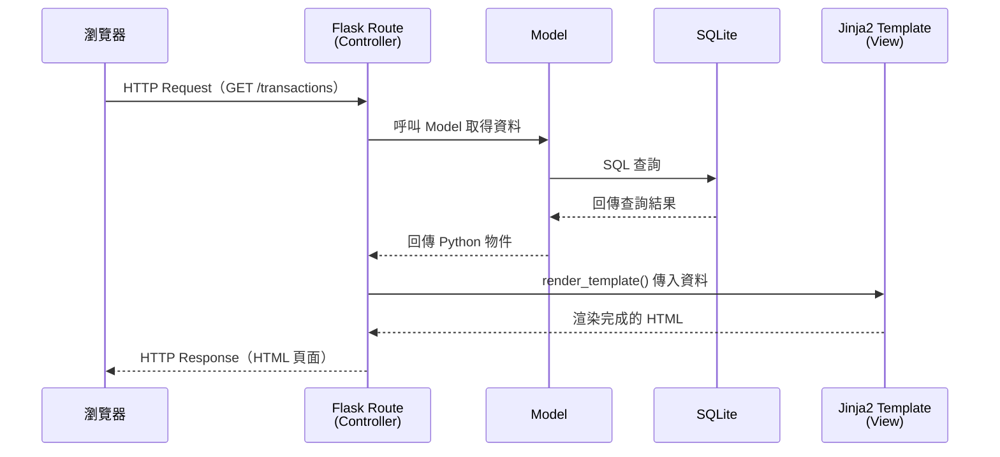
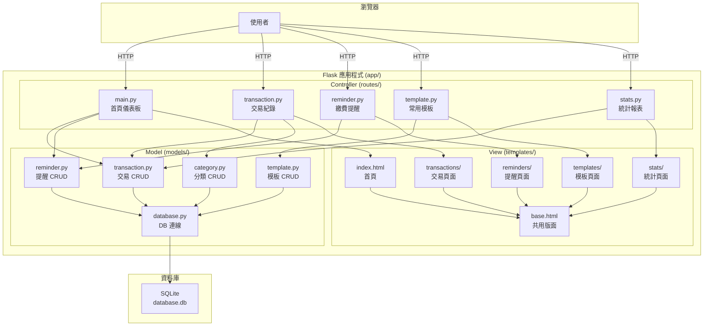

# 個人記帳簿系統 — 系統架構文件

> **版本**：v1.0  
> **建立日期**：2026-04-29  
> **前置文件**：[PRD.md](./PRD.md)  

---

## 1. 技術架構說明

### 1.1 選用技術與原因

| 技術 | 角色 | 選用原因 |
|------|------|----------|
| **Python 3** | 程式語言 | 語法簡潔易學，生態豐富，適合快速開發 |
| **Flask** | 後端框架 | 輕量級微框架，學習曲線低，適合中小型專案 |
| **Jinja2** | 模板引擎 | Flask 內建支援，可直接在 HTML 中嵌入 Python 邏輯 |
| **SQLite** | 資料庫 | 免安裝、零配置，資料存在單一檔案中，適合個人應用 |
| **HTML5 + CSS3** | 前端結構與樣式 | 標準網頁技術，不需額外框架 |
| **JavaScript** | 前端互動 | 處理圖表渲染、動態表單等互動功能 |
| **Chart.js** | 圖表函式庫 | 輕量、易用，適合繪製收支趨勢圖表 |

### 1.2 Flask MVC 模式說明

本專案採用 **MVC（Model–View–Controller）** 架構模式，各層職責如下：

```
┌─────────────────────────────────────────────────────────┐
│                      瀏覽器 (Browser)                     │
│                  使用者透過瀏覽器操作系統                    │
└────────────────────────┬────────────────────────────────┘
                         │ HTTP Request
                         ▼
┌─────────────────────────────────────────────────────────┐
│              Controller（Flask Routes）                   │
│                  app/routes/*.py                         │
│                                                         │
│  • 接收使用者的 HTTP 請求（GET / POST）                    │
│  • 呼叫 Model 讀寫資料                                   │
│  • 將資料傳給 View（模板）渲染成 HTML                      │
│  • 回傳 HTTP Response 給瀏覽器                            │
└──────────┬──────────────────────────┬───────────────────┘
           │                          │
           ▼                          ▼
┌────────────────────┐    ┌──────────────────────────────┐
│   Model（模型）     │    │     View（Jinja2 模板）       │
│  app/models/*.py   │    │   app/templates/*.html       │
│                    │    │                              │
│ • 定義資料表結構    │    │ • HTML 頁面模板              │
│ • 封裝 CRUD 操作   │    │ • 接收 Controller 傳來的資料  │
│ • 資料驗證邏輯     │    │ • 動態渲染頁面內容            │
└────────┬───────────┘    └──────────────────────────────┘
         │
         ▼
┌────────────────────┐
│  SQLite 資料庫      │
│ instance/database.db│
│                    │
│ • 儲存所有交易紀錄  │
│ • 儲存分類、模板等  │
│ • 單一檔案即資料庫  │
└────────────────────┘
```

**簡單來說：**

1. 使用者在瀏覽器點擊按鈕或送出表單
2. **Controller**（路由）接收請求，決定要做什麼
3. Controller 呼叫 **Model** 來讀取或寫入資料庫
4. Controller 把資料交給 **View**（模板）來產生 HTML
5. 瀏覽器收到 HTML 並顯示頁面給使用者

---

## 2. 專案資料夾結構

```
web_app_development-1/
│
├── app.py                     ← 🚀 應用程式入口（啟動 Flask Server）
├── config.py                  ← ⚙️ 設定檔（資料庫路徑、密鑰等）
├── requirements.txt           ← 📦 Python 套件清單
│
├── app/                       ← 📂 主要應用程式目錄
│   ├── __init__.py            ← Flask App 工廠函式（create_app）
│   │
│   ├── models/                ← 📊 Model 層（資料庫模型）
│   │   ├── __init__.py
│   │   ├── database.py        ← 資料庫連線與初始化
│   │   ├── transaction.py     ← 交易紀錄 Model（收入/支出 CRUD）
│   │   ├── category.py        ← 分類 Model（收入/支出分類 CRUD）
│   │   ├── reminder.py        ← 繳費提醒 Model（CRUD）
│   │   └── template.py        ← 常用模板 Model（CRUD）
│   │
│   ├── routes/                ← 🎮 Controller 層（Flask 路由）
│   │   ├── __init__.py
│   │   ├── main.py            ← 首頁儀表板路由
│   │   ├── transaction.py     ← 交易紀錄路由（新增/編輯/刪除/列表）
│   │   ├── reminder.py        ← 繳費提醒路由
│   │   ├── template.py        ← 常用模板路由
│   │   └── stats.py           ← 統計報表路由
│   │
│   ├── templates/             ← 🎨 View 層（Jinja2 HTML 模板）
│   │   ├── base.html          ← 共用版面（導覽列、頁尾、CSS/JS 引入）
│   │   ├── index.html         ← 首頁儀表板
│   │   ├── transactions/
│   │   │   ├── list.html      ← 交易紀錄列表
│   │   │   ├── form.html      ← 新增/編輯交易表單
│   │   │   └── detail.html    ← 交易詳情（選用）
│   │   ├── reminders/
│   │   │   ├── list.html      ← 繳費提醒列表
│   │   │   └── form.html      ← 新增/編輯提醒表單
│   │   ├── templates/
│   │   │   ├── list.html      ← 常用模板列表
│   │   │   └── form.html      ← 新增/編輯模板表單
│   │   └── stats/
│   │       └── index.html     ← 統計報表頁面
│   │
│   └── static/                ← 📁 靜態資源
│       ├── css/
│       │   └── style.css      ← 全站樣式
│       └── js/
│           └── main.js        ← 前端互動邏輯（圖表、表單驗證等）
│
├── instance/                  ← 🗄️ 實例資料（不進版控）
│   └── database.db            ← SQLite 資料庫檔案
│
├── docs/                      ← 📝 專案文件
│   ├── PRD.md                 ← 產品需求文件
│   └── ARCHITECTURE.md        ← 系統架構文件（本文件）
│
└── .gitignore                 ← Git 忽略規則
```

### 各目錄職責對照

| 目錄/檔案 | MVC 層級 | 職責說明 |
|-----------|---------|---------|
| `app/models/` | **Model** | 定義資料表結構，封裝所有資料庫操作（CRUD） |
| `app/routes/` | **Controller** | 處理 HTTP 請求，串接 Model 與 View |
| `app/templates/` | **View** | 定義 HTML 頁面結構，動態渲染資料 |
| `app/static/` | View 輔助 | CSS 樣式、JavaScript 互動邏輯 |
| `instance/` | 資料層 | SQLite 資料庫實體檔案 |
| `config.py` | 設定 | 集中管理應用程式設定 |
| `app.py` | 入口 | 啟動 Flask 開發伺服器 |

---

## 3. 元件關係圖

### 3.1 請求處理流程



### 3.2 系統模組關係



---

## 4. 關鍵設計決策

### 決策 1：使用 Application Factory 模式（`create_app`）

**做法**：在 `app/__init__.py` 中建立 `create_app()` 工廠函式來初始化 Flask 應用。

**原因**：
- 將應用程式的建立邏輯集中管理
- 方便切換不同環境的設定（開發 / 測試）
- 這是 Flask 官方推薦的最佳實踐

```python
# app/__init__.py 範例
def create_app():
    app = Flask(__name__)
    app.config.from_object('config')
    # 註冊 Blueprint、初始化資料庫...
    return app
```

---

### 決策 2：使用 Blueprint 組織路由

**做法**：每個功能模組（交易、提醒、模板、統計）各自建立一個 Flask Blueprint。

**原因**：
- 避免所有路由擠在同一個檔案中，造成程式碼難以維護
- 每個 Blueprint 可以獨立開發與測試
- 團隊成員可以各自負責不同的 Blueprint，減少合併衝突

```python
# app/routes/transaction.py 範例
from flask import Blueprint

transaction_bp = Blueprint('transaction', __name__)

@transaction_bp.route('/transactions')
def list_transactions():
    # ...
```

---

### 決策 3：使用原生 `sqlite3` 而非 ORM

**做法**：直接使用 Python 內建的 `sqlite3` 模組操作資料庫，不使用 SQLAlchemy 等 ORM。

**原因**：
- 減少學習成本，初學者可直接寫 SQL 語法
- 減少外部套件依賴
- 專案規模小（個人使用），ORM 的抽象層反而增加複雜度
- 透過 Model 層封裝 SQL，仍然保持程式碼整潔

```python
# app/models/transaction.py 範例
def get_all_transactions():
    db = get_db()
    return db.execute('SELECT * FROM transactions ORDER BY date DESC').fetchall()
```

---

### 決策 4：收入與支出合併為單一 `transactions` 資料表

**做法**：不分開建立 `incomes` 和 `expenses` 兩張表，而是用一個 `type` 欄位（`income` / `expense`）區分。

**原因**：
- 簡化查詢邏輯：計算餘額只需一次查詢（SUM income - SUM expense）
- 減少重複程式碼：新增/編輯/刪除共用同一套路由與模板
- 交易列表頁面可以一次顯示所有紀錄，不需跨表合併

---

### 決策 5：共用 `base.html` 模板與導覽列

**做法**：建立 `base.html` 作為所有頁面的共用版面，包含導覽列、頁尾、CSS/JS 引入。各頁面透過 Jinja2 的 `` 繼承。

**原因**：
- 確保全站視覺一致性
- 修改導覽列或引入新的 CSS/JS 只需改一個檔案
- 減少 HTML 重複程式碼

```html
<!-- app/templates/base.html 範例 -->
<!DOCTYPE html>
<html>
<head>
    <link rel="stylesheet" href="{{ url_for('static', filename='css/style.css') }}">
</head>
<body>
    <nav><!-- 導覽列 --></nav>
    
    <script src="{{ url_for('static', filename='js/main.js') }}"></script>
</body>
</html>
```

---

## 5. 設定檔規劃

```python
# config.py
import os

BASE_DIR = os.path.abspath(os.path.dirname(__file__))

SECRET_KEY = os.environ.get('SECRET_KEY', 'dev-secret-key')
DATABASE = os.path.join(BASE_DIR, 'instance', 'database.db')
```

---

## 6. 套件需求

```
# requirements.txt
Flask==3.1.*
```

> **說明**：SQLite 與 Jinja2 為 Python / Flask 內建，無需額外安裝。Chart.js 透過 CDN 引入，不需 Python 套件。

---

> **下一步**：待團隊確認架構文件後，進入 Flowchart（流程圖設計）階段。
