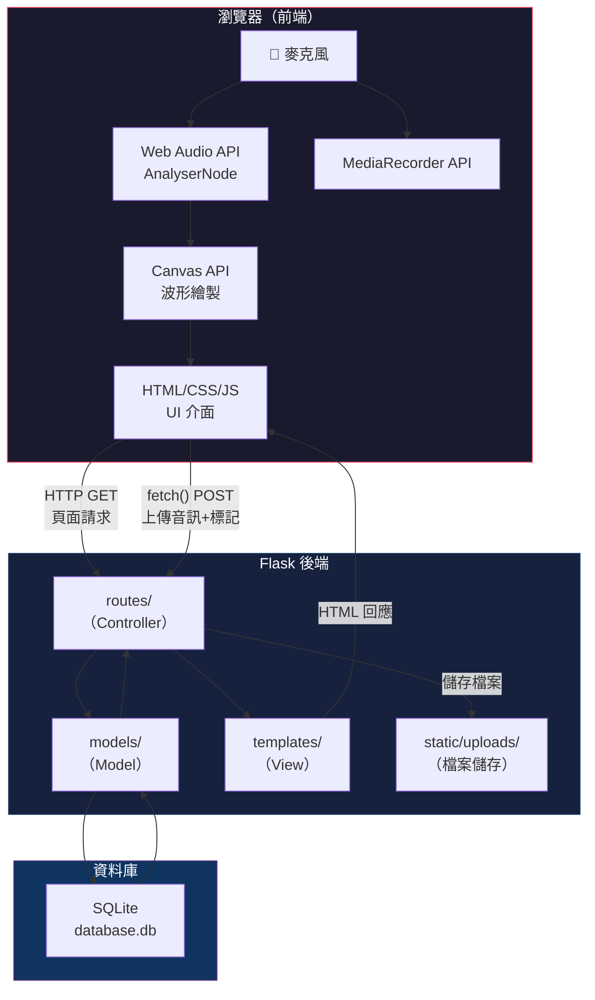
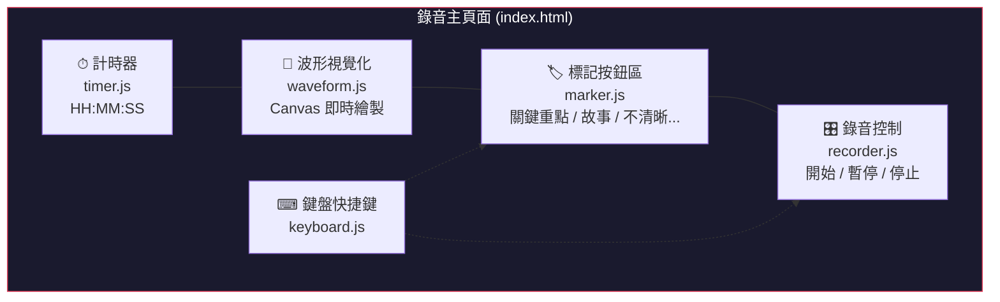
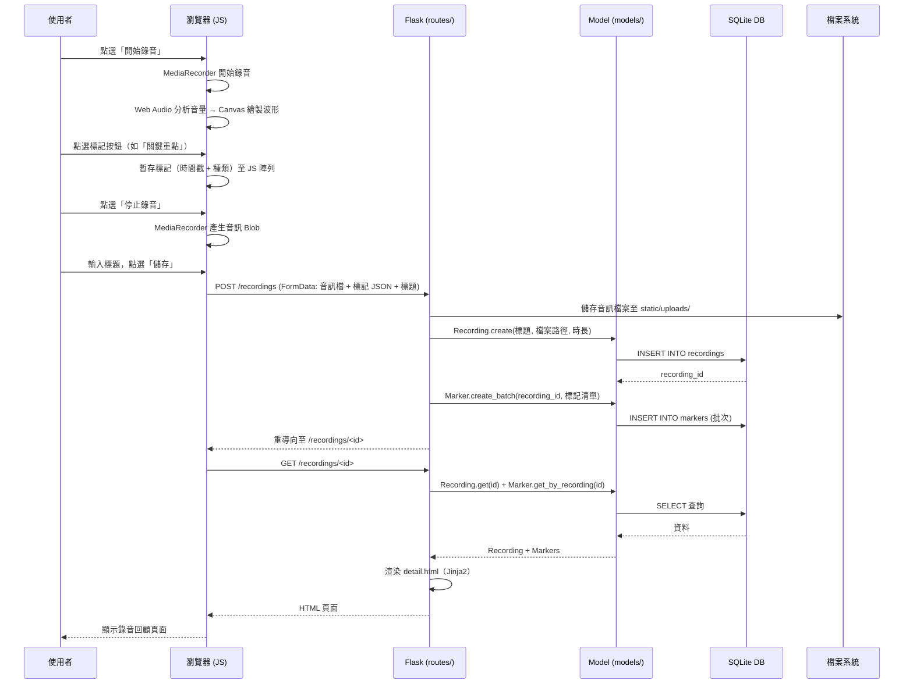

# 系統架構設計 — 即時標記錄音系統

> **文件版本：** v1.0
> **建立日期：** 2026-05-19
> **依據文件：** [PRD.md](PRD.md)

---

## 1. 技術架構說明

### 1.1 選用技術與原因

| 技術 | 角色 | 選用原因 |
|------|------|---------|
| **Python + Flask** | 後端 Web 框架 | 輕量、易上手，適合快速開發原型；豐富的套件生態系 |
| **Jinja2** | HTML 模板引擎 | Flask 內建，支援模板繼承與巨集，減少重複 HTML |
| **SQLite** | 關聯式資料庫 | 零配置、單檔案部署，適合單機 / 小團隊使用情境 |
| **Web Audio API** | 前端音訊擷取與分析 | 瀏覽器原生 API，可即時取得音量資料繪製波形 |
| **MediaRecorder API** | 前端錄音 | 瀏覽器原生 API，可將麥克風串流錄製為音訊檔案 |
| **Canvas API** | 前端波形繪製 | 高效能 2D 繪圖，適合每秒 60 幀的即時波形動畫 |
| **vanilla JavaScript** | 前端互動邏輯 | 不依賴前端框架，降低複雜度，適合教學情境 |

### 1.2 Flask MVC 模式說明

本專案採用 **MVC（Model-View-Controller）** 架構模式，將程式碼依職責分層：

```
┌─────────────────────────────────────────────────────────────┐
│                        瀏覽器 (Browser)                      │
│  ┌───────────────────────────────────────────────────────┐  │
│  │  Web Audio API / MediaRecorder / Canvas（前端 JS）      │  │
│  └───────────────────────────────────────────────────────┘  │
└──────────────────────────┬──────────────────────────────────┘
                           │ HTTP Request / 上傳音訊檔
                           ▼
┌─────────────────────────────────────────────────────────────┐
│                   Flask 後端 (Server)                        │
│                                                             │
│  ┌─────────────┐   ┌──────────────┐   ┌──────────────────┐ │
│  │ Controller  │──▶│    Model     │──▶│    SQLite DB     │ │
│  │ (routes/)   │   │  (models/)   │   │ (instance/       │ │
│  │             │◀──│              │◀──│   database.db)   │ │
│  └──────┬──────┘   └──────────────┘   └──────────────────┘ │
│         │                                                   │
│         ▼                                                   │
│  ┌─────────────┐                                            │
│  │    View     │                                            │
│  │(templates/) │──▶ HTML 回應給瀏覽器                         │
│  └─────────────┘                                            │
└─────────────────────────────────────────────────────────────┘
```

| 層級 | 資料夾 | 職責 |
|------|-------|------|
| **Model（模型）** | `app/models/` | 定義資料結構、負責與 SQLite 資料庫的讀寫操作（CRUD） |
| **View（視圖）** | `app/templates/` | Jinja2 HTML 模板，負責頁面的呈現與排版 |
| **Controller（控制器）** | `app/routes/` | Flask 路由，接收 HTTP 請求、呼叫 Model、選擇 View 回傳 |
| **Static（靜態資源）** | `app/static/` | CSS 樣式表、JavaScript 腳本（含音訊處理）、圖片等 |

### 1.3 前後端協作模式

本系統的特殊之處在於**錄音與波形視覺化完全在前端（瀏覽器）執行**，後端負責**資料持久化與頁面渲染**：

```
前端（瀏覽器）負責：                    後端（Flask）負責：
├── 麥克風存取與錄音 (MediaRecorder)     ├── 頁面渲染 (Jinja2)
├── 即時波形繪製 (Web Audio + Canvas)    ├── 接收 & 儲存錄音檔案
├── 計時器顯示                          ├── 標記資料 CRUD
├── 標記按鈕 UI 與暫存                  ├── 錄音後設資料管理
└── 鍵盤快捷鍵監聽                      └── API 端點（整合用）
```

> **關鍵流程：** 使用者在前端完成錄音 → 點選「停止」→ 前端將**音訊 Blob** 與**標記 JSON** 一起透過 `fetch()` 上傳至後端 → 後端儲存檔案與資料庫記錄。

---

## 2. 專案資料夾結構

```
即時標記錄音系統/
│
├── app.py                          ← Flask 應用程式入口
├── config.py                       ← 設定檔（SECRET_KEY、DB 路徑等）
├── requirements.txt                ← Python 套件依賴清單
│
├── app/                            ← 主要應用程式套件
│   ├── __init__.py                 ← Flask app 工廠函式（create_app）
│   │
│   ├── models/                     ← Model 層：資料庫模型
│   │   ├── __init__.py
│   │   ├── recording.py            ← 錄音紀錄模型（Recording）
│   │   ├── marker.py               ← 標記模型（Marker）
│   │   └── marker_type.py          ← 標記種類模型（MarkerType）
│   │
│   ├── routes/                     ← Controller 層：Flask 路由
│   │   ├── __init__.py
│   │   ├── main.py                 ← 首頁 / 錄音主頁路由
│   │   ├── recording.py            ← 錄音相關路由（儲存、列表、詳情、刪除）
│   │   ├── marker.py               ← 標記相關路由（CRUD）
│   │   └── api.py                  ← RESTful API 端點（系統整合用）
│   │
│   ├── templates/                  ← View 層：Jinja2 HTML 模板
│   │   ├── base.html               ← 基礎模板（共用 header / footer / CSS / JS 引入）
│   │   ├── index.html              ← 錄音主頁面（波形 + 計時器 + 標記 + 控制按鈕）
│   │   ├── save.html               ← 錄音儲存表單頁面
│   │   ├── recordings/
│   │   │   ├── list.html           ← 錄音列表頁面
│   │   │   └── detail.html         ← 錄音詳情 / 回顧頁面
│   │   └── settings/
│   │       └── marker_types.html   ← 標記種類管理頁面
│   │
│   └── static/                     ← 靜態資源
│       ├── css/
│       │   └── style.css           ← 全站樣式
│       ├── js/
│       │   ├── recorder.js         ← 錄音控制邏輯（MediaRecorder 封裝）
│       │   ├── waveform.js         ← 波形視覺化邏輯（Web Audio + Canvas）
│       │   ├── timer.js            ← 計時器邏輯
│       │   ├── marker.js           ← 標記按鈕互動邏輯
│       │   └── keyboard.js         ← 鍵盤快捷鍵監聽
│       └── uploads/                ← 上傳的錄音檔案存放處
│
├── database/                       ← 資料庫相關
│   └── schema.sql                  ← SQL 建表語法
│
├── instance/                       ← Flask instance 資料夾（自動產生）
│   └── database.db                 ← SQLite 資料庫檔案
│
└── docs/                           ← 設計文件
    ├── PRD.md                      ← 產品需求文件
    ├── ARCHITECTURE.md             ← 系統架構文件（本文件）
    ├── FLOWCHART.md                ← 使用者流程圖
    ├── DB_DESIGN.md                ← 資料庫設計
    └── ROUTES.md                   ← 路由設計
```

### 各資料夾 / 檔案用途說明

| 路徑 | 類型 | 說明 |
|------|------|------|
| `app.py` | 入口 | 啟動 Flask 開發伺服器，呼叫 `create_app()` |
| `config.py` | 設定 | 集中管理環境變數、SECRET_KEY、資料庫路徑、上傳目錄路徑 |
| `requirements.txt` | 依賴 | 列出 `flask` 等所需套件，方便 `pip install -r requirements.txt` |
| `app/__init__.py` | 工廠 | 建立 Flask app 實例、註冊 Blueprint、初始化資料庫 |
| `app/models/` | Model | 每個檔案對應一張資料表，封裝 SQL 查詢為 Python 方法 |
| `app/routes/` | Controller | 每個檔案用 `Blueprint` 組織相關路由，保持模組化 |
| `app/templates/` | View | Jinja2 模板，`base.html` 定義共用版面，其他頁面繼承它 |
| `app/static/js/` | 前端 JS | 各功能拆分為獨立模組，方便維護與分工 |
| `app/static/uploads/` | 檔案儲存 | 錄音音訊檔案的實際儲存位置 |
| `database/schema.sql` | Schema | 資料庫建表 SQL，可用於初始化或重建資料庫 |
| `instance/` | 實例資料 | Flask 內建的 instance 資料夾，存放 SQLite DB 檔案 |

---

## 3. 元件關係圖

### 3.1 整體系統架構圖



### 3.2 錄音主頁面元件圖



### 3.3 資料流向圖



---

## 4. 關鍵設計決策

### 決策 1：錄音在前端完成，後端只負責儲存

**決策：** 使用瀏覽器原生的 `MediaRecorder API` 在前端完成錄音，完成後才將音訊檔案上傳到後端。

**原因：**
- 即時錄音需要極低延遲，若將音訊串流即時傳送到後端會增加網路延遲與複雜度
- 瀏覽器 `MediaRecorder API` 已提供穩定的錄音功能，無需後端介入
- 後端只需處理檔案儲存與後設資料管理，職責更單純

**取捨：**
- 長時間錄音可能受限於瀏覽器記憶體（4 小時上限需測試驗證）
- 若瀏覽器意外關閉，未儲存的錄音將遺失

---

### 決策 2：標記先暫存在前端，隨錄音一併上傳

**決策：** 使用者在錄音過程中的所有標記操作，先暫存於前端 JavaScript 陣列中，待錄音停止並儲存時，與音訊檔案一起上傳至後端。

**原因：**
- 避免錄音過程中頻繁發送 HTTP 請求，影響錄音穩定性
- 標記資料量小（JSON 陣列），與音訊檔案一起上傳不會增加負擔
- 簡化後端邏輯：一次請求完成「儲存錄音 + 儲存所有標記」

**取捨：**
- 若瀏覽器意外關閉，暫存的標記也會遺失（可考慮未來版本加入 `localStorage` 備份）

---

### 決策 3：前端 JavaScript 模組化拆分

**決策：** 將前端 JavaScript 按功能拆分為 5 個獨立模組（`recorder.js`、`waveform.js`、`timer.js`、`marker.js`、`keyboard.js`）。

**原因：**
- 錄音主頁面的前端邏輯較複雜（音訊處理 + 波形繪製 + 計時器 + 標記 + 快捷鍵），若全部寫在一個檔案中會難以維護
- 拆分後每位團隊成員可以獨立負責不同模組，降低合併衝突
- 每個模組職責單一，方便測試與除錯

**模組間溝通方式：**
- 使用全域事件（`CustomEvent`）或共享狀態物件進行模組間通訊
- 例如：`recorder.js` 發出 `recording-started` 事件 → `timer.js` 和 `waveform.js` 接收並開始運作

---

### 決策 4：使用 Flask Blueprint 組織路由

**決策：** 每個功能模組的路由使用獨立的 `Blueprint` 註冊，而非全部寫在一個檔案中。

**原因：**
- 路由分散在 `main.py`、`recording.py`、`marker.py`、`api.py`，各自負責不同功能
- 團隊成員可以平行開發不同路由檔案，減少 Git 合併衝突
- 未來擴充新功能時，只需新增 Blueprint，不影響既有程式碼

**註冊方式：**
```python
# app/__init__.py
from app.routes.main import main_bp
from app.routes.recording import recording_bp
from app.routes.marker import marker_bp
from app.routes.api import api_bp

app.register_blueprint(main_bp)
app.register_blueprint(recording_bp)
app.register_blueprint(marker_bp)
app.register_blueprint(api_bp, url_prefix='/api')
```

---

### 決策 5：預留 RESTful API 層為未來整合做準備

**決策：** 在 `routes/api.py` 中獨立設計 RESTful API 端點，與頁面路由分開。

**原因：**
- PRD 明確要求與「語音轉寫」、「AI 摘要」、「訪談歷史管理」等系統整合
- API 端點回傳 JSON，頁面路由回傳 HTML，兩者職責不同，應分開管理
- 使用 `/api` URL 前綴統一命名，便於識別與日後加入權限驗證

**MVP 階段：** API 層先建立骨架，實際整合邏輯待外部系統就緒後再實作。

---

## 5. 技術元件協作總覽

```
使用者操作          前端技術                   後端技術              資料儲存
──────────       ─────────────            ──────────          ──────────
開始錄音     →   MediaRecorder.start()
看到波形     ←   AnalyserNode + Canvas
點標記按鈕   →   JS 暫存至陣列
看到計時     ←   setInterval + DOM
停止錄音     →   MediaRecorder.stop()
輸入標題     →   HTML Form
點選儲存     →   fetch() POST           →  Flask Route       → SQLite + 檔案
                                           ↓
                                        Model.create()
                                           ↓
查看回顧     ←   HTML 頁面              ←  Jinja2 Template   ← SQLite 查詢
點標記跳轉   →   Audio.currentTime = t
```

---

> **下一步：** 架構確認後，請進入流程圖設計階段（`/flowchart`），將使用者操作路徑視覺化。
