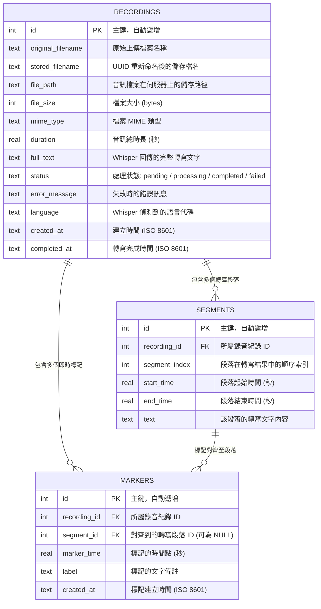

# 資料庫設計文件：語音轉寫與 API 整合系統

本文件根據 PRD 與系統架構文件，定義系統所需的 SQLite 資料表結構、欄位說明與關聯關係。

## 1. ER 圖（實體關係圖）

---

## 2. 資料表詳細說明

### 2.1 `recordings` — 錄音紀錄表

儲存每一次音訊上傳的基本資訊與轉寫處理狀態。

| 欄位 | 型別 | 必填 | 預設值 | 說明 |
|---|---|:---:|---|---|
| `id` | INTEGER | ✅ | AUTOINCREMENT | 主鍵 |
| `original_filename` | TEXT | ✅ | — | 使用者上傳時的原始檔案名稱 |
| `stored_filename` | TEXT | ✅ | — | UUID 重新命名後的檔名，防止衝突與路徑穿越 |
| `file_path` | TEXT | ✅ | — | 檔案在 `instance/uploads/` 中的完整路徑 |
| `file_size` | INTEGER | ✅ | — | 檔案大小（位元組） |
| `mime_type` | TEXT | ✅ | — | 檔案的 MIME 類型（如 `audio/mpeg`） |
| `duration` | REAL | ❌ | NULL | 音訊總時長（秒），由 Whisper 回傳後更新 |
| `full_text` | TEXT | ❌ | NULL | Whisper 回傳的完整逐字稿文字 |
| `status` | TEXT | ✅ | `'pending'` | 處理狀態：`pending` → `processing` → `completed` / `failed` |
| `error_message` | TEXT | ❌ | NULL | 轉寫失敗時的錯誤原因說明 |
| `language` | TEXT | ❌ | NULL | Whisper 偵測到的語言代碼（如 `zh`） |
| `created_at` | TEXT | ✅ | `CURRENT_TIMESTAMP` | 紀錄建立時間（ISO 8601 格式） |
| `completed_at` | TEXT | ❌ | NULL | 轉寫完成時間（ISO 8601 格式） |

---

### 2.2 `segments` — 轉寫段落表

儲存 Whisper API 回傳的每一個句子段落，包含起止時間與文字內容。

| 欄位 | 型別 | 必填 | 預設值 | 說明 |
|---|---|:---:|---|---|
| `id` | INTEGER | ✅ | AUTOINCREMENT | 主鍵 |
| `recording_id` | INTEGER | ✅ | — | 外鍵，關聯至 `recordings.id` |
| `segment_index` | INTEGER | ✅ | — | 段落在轉寫結果中的順序（從 0 開始） |
| `start_time` | REAL | ✅ | — | 段落起始時間（秒） |
| `end_time` | REAL | ✅ | — | 段落結束時間（秒） |
| `text` | TEXT | ✅ | — | 該段落轉寫出的文字內容 |

**關聯**：`recording_id` → `recordings.id`（多對一），刪除錄音時級聯刪除所有段落。

---

### 2.3 `markers` — 即時標記表

儲存前端錄音時使用者按下的即時標記時間點，以及對齊到的轉寫段落。

| 欄位 | 型別 | 必填 | 預設值 | 說明 |
|---|---|:---:|---|---|
| `id` | INTEGER | ✅ | AUTOINCREMENT | 主鍵 |
| `recording_id` | INTEGER | ✅ | — | 外鍵，關聯至 `recordings.id` |
| `segment_id` | INTEGER | ❌ | NULL | 外鍵，對齊到的轉寫段落 `segments.id`。轉寫完成後由對齊邏輯填入 |
| `marker_time` | REAL | ✅ | — | 標記的時間點（秒），相對於錄音開始時間 |
| `label` | TEXT | ❌ | `''` | 使用者為該標記添加的文字備註 |
| `created_at` | TEXT | ✅ | `CURRENT_TIMESTAMP` | 標記建立時間（ISO 8601 格式） |

**關聯**：
- `recording_id` → `recordings.id`（多對一），刪除錄音時級聯刪除所有標記。
- `segment_id` → `segments.id`（多對一，可為 NULL），若標記時間點未落入任何段落區間則為 NULL。

---

## 3. SQL 建表語法

完整的 SQLite 建表 SQL 請參見 [`database/schema.sql`](../database/schema.sql)。
