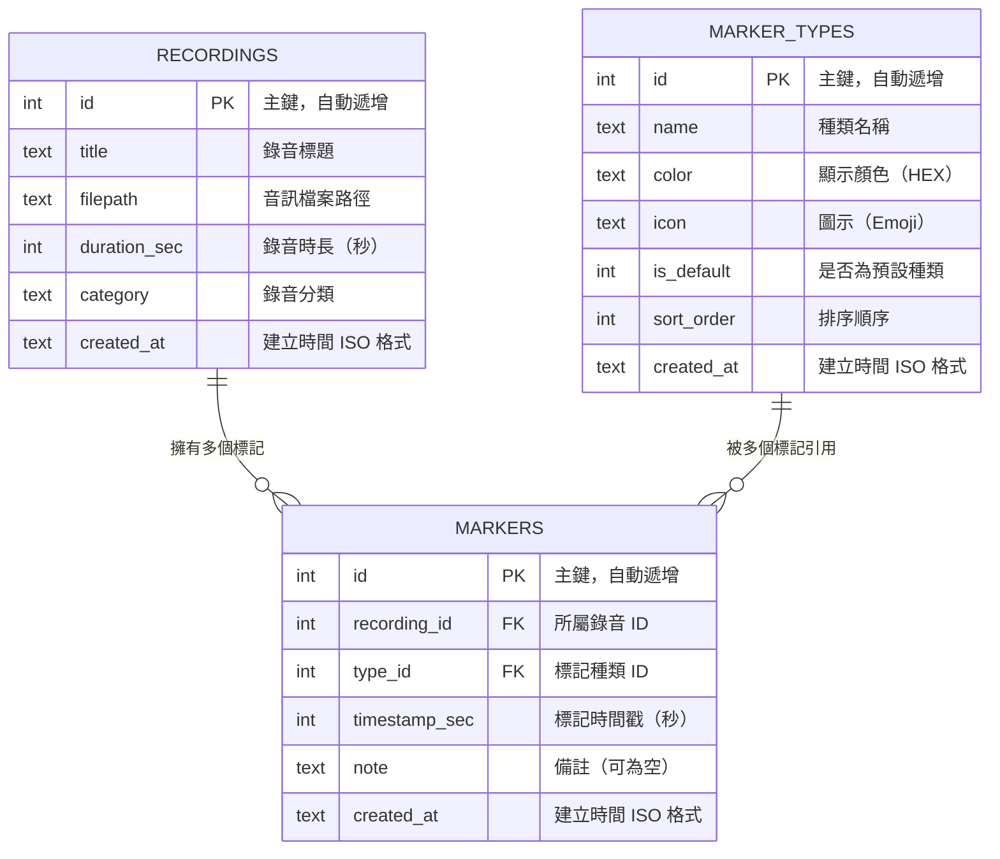

# 資料庫設計 — 即時標記錄音系統

> **文件版本：** v1.0
> **建立日期：** 2026-05-19
> **依據文件：** [PRD.md](PRD.md)、[ARCHITECTURE.md](ARCHITECTURE.md)、[FLOWCHART.md](FLOWCHART.md)

---

## 1. ER 圖（實體關係圖）



---

## 2. 資料表詳細說明

### 2.1 recordings（錄音紀錄）

儲存每一次錄音的後設資料與檔案路徑。

| 欄位 | 型別 | 必填 | 預設值 | 說明 |
|------|------|------|--------|------|
| `id` | INTEGER | ✅ | 自動遞增 | 主鍵（PK） |
| `title` | TEXT | ✅ | — | 錄音標題（使用者輸入，預設為日期時間） |
| `filepath` | TEXT | ✅ | — | 音訊檔案相對路徑（如 `uploads/rec_20260519.webm`） |
| `duration_sec` | INTEGER | ✅ | 0 | 錄音總時長（秒） |
| `category` | TEXT | ❌ | NULL | 錄音分類標籤（使用者自訂） |
| `created_at` | TEXT | ✅ | CURRENT_TIMESTAMP | 建立時間（ISO 8601 格式） |

**索引：**
- `id`（Primary Key）
- `created_at`（用於排序查詢）

---

### 2.2 markers（標記）

儲存每個錄音中使用者標記的時間點與備註。

| 欄位 | 型別 | 必填 | 預設值 | 說明 |
|------|------|------|--------|------|
| `id` | INTEGER | ✅ | 自動遞增 | 主鍵（PK） |
| `recording_id` | INTEGER | ✅ | — | 所屬錄音 ID（FK → recordings.id） |
| `type_id` | INTEGER | ✅ | — | 標記種類 ID（FK → marker_types.id） |
| `timestamp_sec` | INTEGER | ✅ | — | 標記對應的錄音時間（秒） |
| `note` | TEXT | ❌ | NULL | 使用者輸入的簡短備註 |
| `created_at` | TEXT | ✅ | CURRENT_TIMESTAMP | 建立時間（ISO 8601 格式） |

**索引：**
- `id`（Primary Key）
- `recording_id`（用於查詢某錄音的所有標記）
- `type_id`（用於依種類篩選）

**外鍵關聯：**
- `recording_id` → `recordings.id`（CASCADE DELETE：刪除錄音時一併刪除所有標記）
- `type_id` → `marker_types.id`（RESTRICT：不允許刪除仍被引用的標記種類）

---

### 2.3 marker_types（標記種類）

儲存系統預設與使用者自訂的標記種類定義。

| 欄位 | 型別 | 必填 | 預設值 | 說明 |
|------|------|------|--------|------|
| `id` | INTEGER | ✅ | 自動遞增 | 主鍵（PK） |
| `name` | TEXT | ✅ | — | 種類名稱（如「關鍵重點」、「故事」） |
| `color` | TEXT | ✅ | `#e94560` | 顯示顏色（HEX 色碼） |
| `icon` | TEXT | ✅ | `🏷` | 圖示（Emoji 字元） |
| `is_default` | INTEGER | ✅ | 0 | 是否為系統預設種類（1=是, 0=否） |
| `sort_order` | INTEGER | ✅ | 0 | 排序順序（數字越小越前面） |
| `created_at` | TEXT | ✅ | CURRENT_TIMESTAMP | 建立時間（ISO 8601 格式） |

**索引：**
- `id`（Primary Key）
- `sort_order`（用於排序顯示）

**預設資料（Seed Data）：**

| id | name | color | icon | is_default | sort_order |
|----|------|-------|------|------------|------------|
| 1 | 關鍵重點 | `#e94560` | 🔑 | 1 | 1 |
| 2 | 故事 | `#0f3460` | 📖 | 1 | 2 |
| 3 | 不清晰 | `#f39c12` | ❓ | 1 | 3 |
| 4 | 行動項目 | `#2ecc71` | ⚡ | 1 | 4 |
| 5 | 靈感 | `#9b59b6` | 💡 | 1 | 5 |

---

## 3. 資料表關聯說明

```
marker_types (1) ──────< (N) markers (N) >────── (1) recordings
    │                          │                        │
    │  一個標記種類             │  一個標記               │  一個錄音
    │  可被多個標記引用         │  屬於一個錄音            │  可擁有多個標記
    │                          │  引用一個標記種類         │
```

- **recordings → markers**：一對多（One-to-Many）
  - 一個錄音可以有 0 到多個標記
  - 刪除錄音時，級聯刪除所有標記（CASCADE）

- **marker_types → markers**：一對多（One-to-Many）
  - 一個標記種類可被多個標記引用
  - 不允許刪除仍被使用的標記種類（RESTRICT）

---

## 4. SQL 建表語法

完整的 SQL 建表語法已儲存於 `database/schema.sql`，請參閱該檔案。

---

> **下一步：** 資料庫設計確認後，請進入路由設計階段（`/api-design`）。
