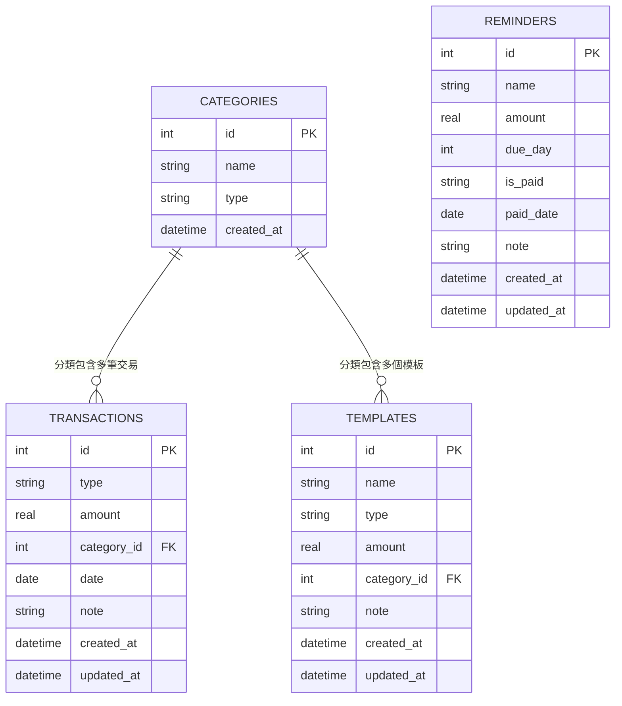

# 個人記帳簿系統 — 資料庫設計文件

> **版本**：v1.0  
> **建立日期**：2026-04-29  
> **前置文件**：[PRD.md](./PRD.md) ｜ [ARCHITECTURE.md](./ARCHITECTURE.md) ｜ [FLOWCHART.md](./FLOWCHART.md)  

---

## 1. ER 圖（實體關係圖）

---

## 2. 資料表詳細說明

### 2.1 categories（分類）

儲存收入與支出的分類標籤。

| 欄位 | 型別 | 必填 | 說明 |
|------|------|------|------|
| `id` | INTEGER | ✅ | 主鍵，自動遞增 |
| `name` | TEXT | ✅ | 分類名稱（如「薪資」、「餐飲」） |
| `type` | TEXT | ✅ | 分類類型：`income`（收入）或 `expense`（支出） |
| `created_at` | TEXT | ✅ | 建立時間（ISO 8601 格式） |

- **Primary Key**：`id`
- **約束**：`name` + `type` 組合唯一，避免重複分類

---

### 2.2 transactions（交易紀錄）

儲存所有收入與支出紀錄，收入與支出共用同一張表，透過 `type` 欄位區分。

| 欄位 | 型別 | 必填 | 說明 |
|------|------|------|------|
| `id` | INTEGER | ✅ | 主鍵，自動遞增 |
| `type` | TEXT | ✅ | 交易類型：`income`（收入）或 `expense`（支出） |
| `amount` | REAL | ✅ | 金額（正數） |
| `category_id` | INTEGER | ✅ | 分類 ID，外鍵關聯 `categories.id` |
| `date` | TEXT | ✅ | 交易日期（YYYY-MM-DD 格式） |
| `note` | TEXT | ❌ | 備註說明 |
| `created_at` | TEXT | ✅ | 建立時間（ISO 8601 格式） |
| `updated_at` | TEXT | ✅ | 最後更新時間（ISO 8601 格式） |

- **Primary Key**：`id`
- **Foreign Key**：`category_id` → `categories(id)`

---

### 2.3 reminders（繳費提醒）

儲存每月定期帳單的提醒設定。

| 欄位 | 型別 | 必填 | 說明 |
|------|------|------|------|
| `id` | INTEGER | ✅ | 主鍵，自動遞增 |
| `name` | TEXT | ✅ | 帳單名稱（如「房租」、「電費」） |
| `amount` | REAL | ✅ | 應繳金額 |
| `due_day` | INTEGER | ✅ | 每月到期日（1–31） |
| `is_paid` | TEXT | ✅ | 本月是否已繳：`yes` 或 `no`，預設 `no` |
| `paid_date` | TEXT | ❌ | 實際繳費日期（YYYY-MM-DD 格式） |
| `note` | TEXT | ❌ | 備註說明 |
| `created_at` | TEXT | ✅ | 建立時間 |
| `updated_at` | TEXT | ✅ | 最後更新時間 |

- **Primary Key**：`id`

---

### 2.4 templates（常用模板）

儲存使用者建立的常用交易模板，用於一鍵快速記帳。

| 欄位 | 型別 | 必填 | 說明 |
|------|------|------|------|
| `id` | INTEGER | ✅ | 主鍵，自動遞增 |
| `name` | TEXT | ✅ | 模板名稱（如「午餐」、「通勤」） |
| `type` | TEXT | ✅ | 交易類型：`income` 或 `expense` |
| `amount` | REAL | ✅ | 預設金額 |
| `category_id` | INTEGER | ✅ | 分類 ID，外鍵關聯 `categories.id` |
| `note` | TEXT | ❌ | 預設備註 |
| `created_at` | TEXT | ✅ | 建立時間 |
| `updated_at` | TEXT | ✅ | 最後更新時間 |

- **Primary Key**：`id`
- **Foreign Key**：`category_id` → `categories(id)`

---

## 3. 預設分類資料

系統初始化時會自動建立以下預設分類：

### 收入分類（income）

| 名稱 |
|------|
| 薪資 |
| 獎金 |
| 兼職 |
| 投資收益 |
| 其他收入 |

### 支出分類（expense）

| 名稱 |
|------|
| 餐飲 |
| 交通 |
| 住宿 |
| 娛樂 |
| 日用品 |
| 醫療 |
| 教育 |
| 訂閱服務 |
| 其他支出 |

---

> **下一步**：待團隊確認資料庫設計後，進入 API Design（路由設計）階段。
