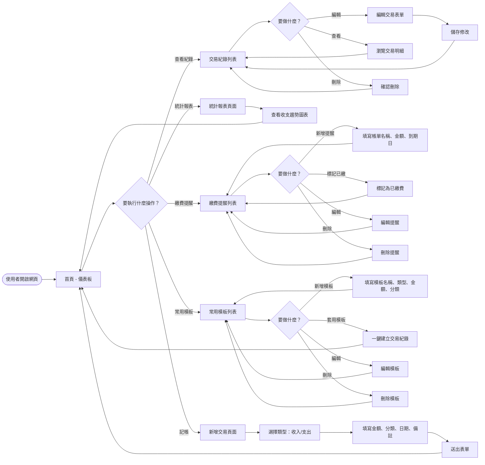
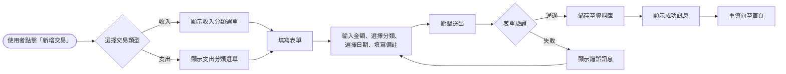
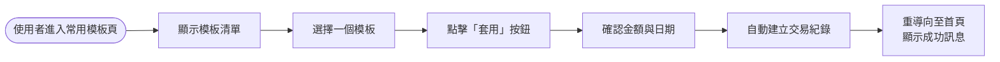
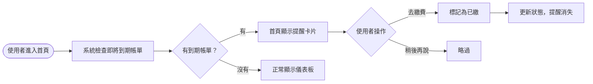
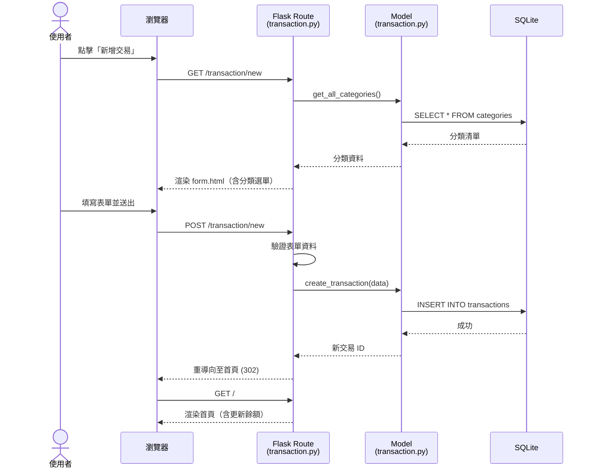
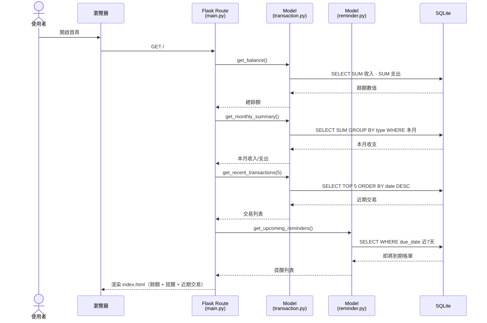
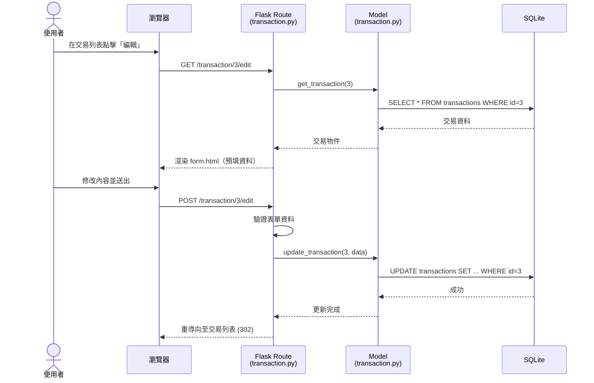
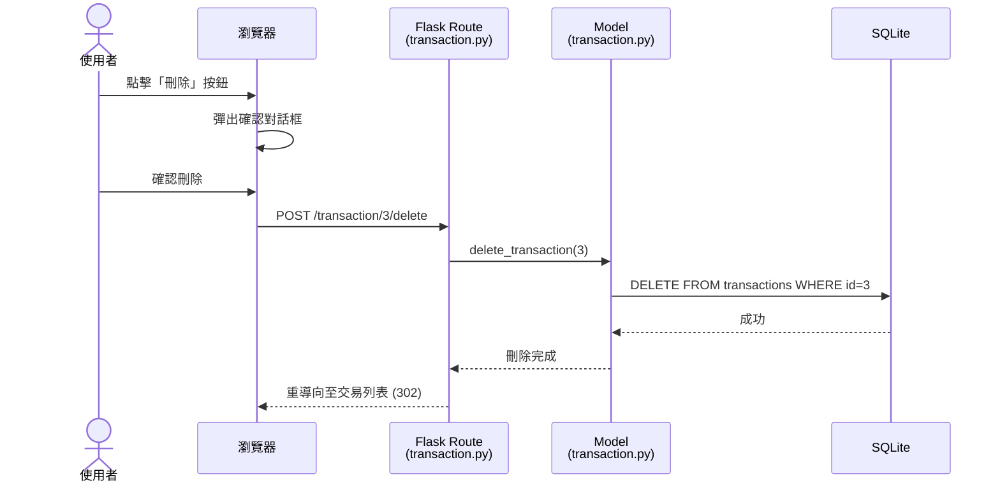
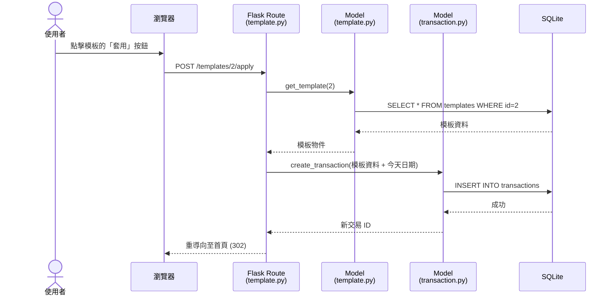

# 個人記帳簿系統 — 流程圖文件

> **版本**：v1.0  
> **建立日期**：2026-04-29  
> **前置文件**：[PRD.md](./PRD.md) ｜ [ARCHITECTURE.md](./ARCHITECTURE.md)  

---

## 1. 使用者流程圖（User Flow）

### 1.1 主流程總覽

從使用者進入網站開始，涵蓋所有主要功能的操作路徑。

### 1.2 新增交易流程（詳細版）

### 1.3 使用常用模板記帳流程

### 1.4 繳費提醒流程

---

## 2. 系統序列圖（Sequence Diagram）

### 2.1 新增交易紀錄

描述「使用者填寫表單」到「資料存入資料庫」的完整流程。

### 2.2 查看首頁儀表板

### 2.3 編輯交易紀錄

### 2.4 刪除交易紀錄

### 2.5 套用常用模板

---

## 3. 功能清單對照表

| 功能 | 頁面 | URL 路徑 | HTTP 方法 | 說明 |
|------|------|----------|-----------|------|
| 首頁儀表板 | 儀表板 | `/` | GET | 顯示餘額、本月收支、即將到期帳單、近期交易 |
| 新增交易 | 交易表單 | `/transaction/new` | GET / POST | GET 顯示表單，POST 儲存新交易 |
| 交易列表 | 交易列表 | `/transactions` | GET | 瀏覽所有交易紀錄，支援分類篩選 |
| 編輯交易 | 交易表單 | `/transaction/<id>/edit` | GET / POST | GET 顯示預填表單，POST 更新交易 |
| 刪除交易 | — | `/transaction/<id>/delete` | POST | 刪除指定交易紀錄 |
| 繳費提醒列表 | 提醒列表 | `/reminders` | GET | 顯示所有繳費提醒 |
| 新增提醒 | 提醒表單 | `/reminder/new` | GET / POST | GET 顯示表單，POST 儲存新提醒 |
| 編輯提醒 | 提醒表單 | `/reminder/<id>/edit` | GET / POST | GET 顯示預填表單，POST 更新提醒 |
| 刪除提醒 | — | `/reminder/<id>/delete` | POST | 刪除指定提醒 |
| 標記已繳 | — | `/reminder/<id>/paid` | POST | 標記提醒為已繳費 |
| 常用模板列表 | 模板列表 | `/templates` | GET | 顯示所有常用模板 |
| 新增模板 | 模板表單 | `/template/new` | GET / POST | GET 顯示表單，POST 儲存新模板 |
| 編輯模板 | 模板表單 | `/template/<id>/edit` | GET / POST | GET 顯示預填表單，POST 更新模板 |
| 刪除模板 | — | `/template/<id>/delete` | POST | 刪除指定模板 |
| 套用模板 | — | `/template/<id>/apply` | POST | 以模板資料建立新交易紀錄 |
| 統計報表 | 統計頁面 | `/stats` | GET | 顯示收支趨勢圖表 |

---

> **下一步**：待團隊確認流程圖後，進入 DB Design（資料庫設計）階段。
