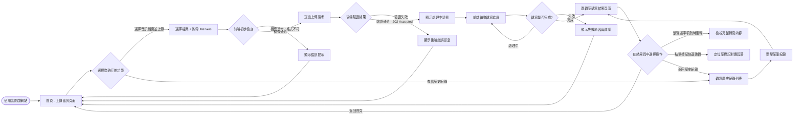
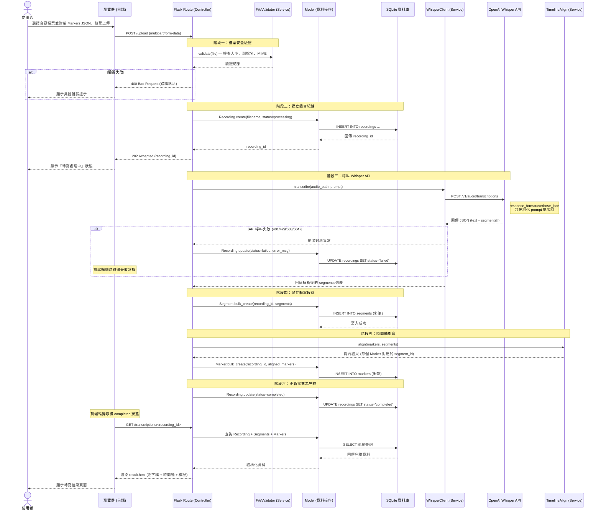
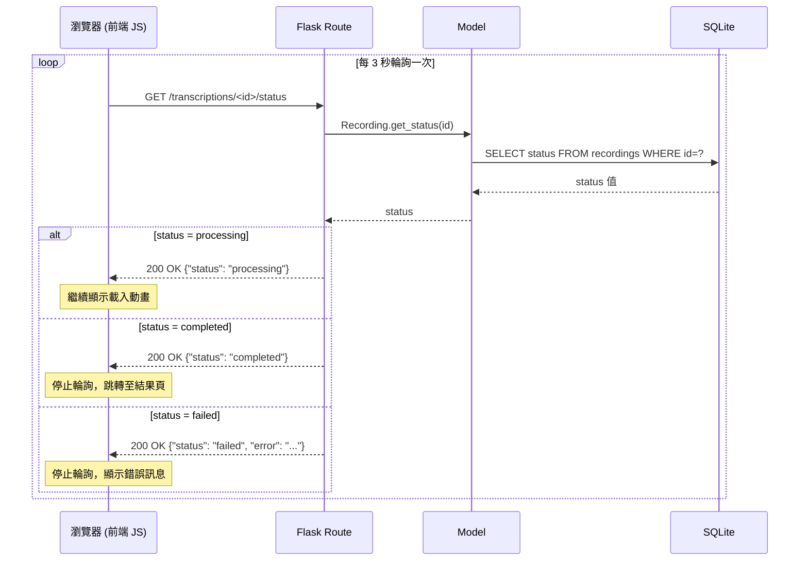

# 流程圖設計文件：語音轉寫與 API 整合系統

本文件根據產品需求文件 (PRD) 與系統架構文件，視覺化使用者在語音轉寫系統中的操作流程、系統背後的處理步驟，以及功能與路由的對照表。

## 1. 使用者流程圖（User Flow）

以下流程圖說明使用者從開啟網頁到完成音訊上傳、等待轉寫、查看結果的完整操作路徑：

## 2. 系統序列圖（Sequence Diagram）

### 2.1 核心流程：音訊上傳與語音轉寫

以下序列圖展示從使用者上傳音訊到 Whisper API 完成轉寫、結果存入資料庫的完整過程：

### 2.2 輔助流程：前端狀態輪詢

## 3. 功能清單對照表

對應上述流程與 PRD 需求，以下為系統功能對應的 URL 路徑與 HTTP 方法整理，提供後續路由設計的參考：

| 功能項目說明 | HTTP 方法 | 預計對應的 URL 路徑 | View (Jinja2) | 備註 |
| --- | :---: | --- | --- | --- |
| **首頁 / 音訊上傳頁面** | `GET` | `/` | `upload.html` | 顯示上傳表單與使用說明 |
| **提交音訊檔案上傳** | `POST` | `/upload` | *(JSON 回應)* | 接收 multipart/form-data，含音訊檔案與 Markers JSON。回傳 202 + recording_id |
| **查詢轉寫處理狀態** | `GET` | `/transcriptions/<id>/status` | *(JSON 回應)* | 供前端輪詢使用，回傳 `{"status": "processing/completed/failed"}` |
| **查看單筆轉寫結果** | `GET` | `/transcriptions/<id>` | `result.html` | 顯示完整逐字稿、每句時間戳、即時標記對齊結果 |
| **轉寫歷史紀錄列表** | `GET` | `/transcriptions` | `history.html` | 列出所有錄音紀錄，含狀態、上傳時間、檔案名稱 |
