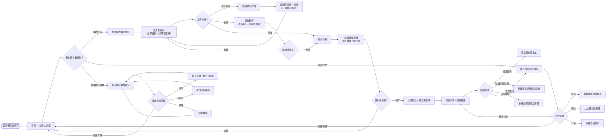
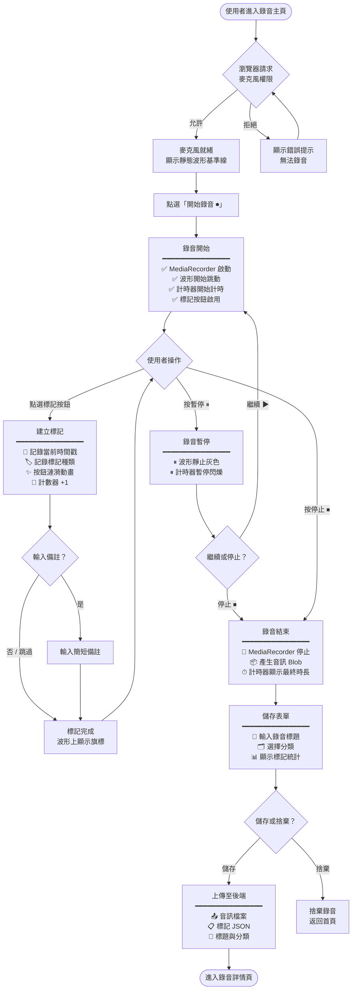
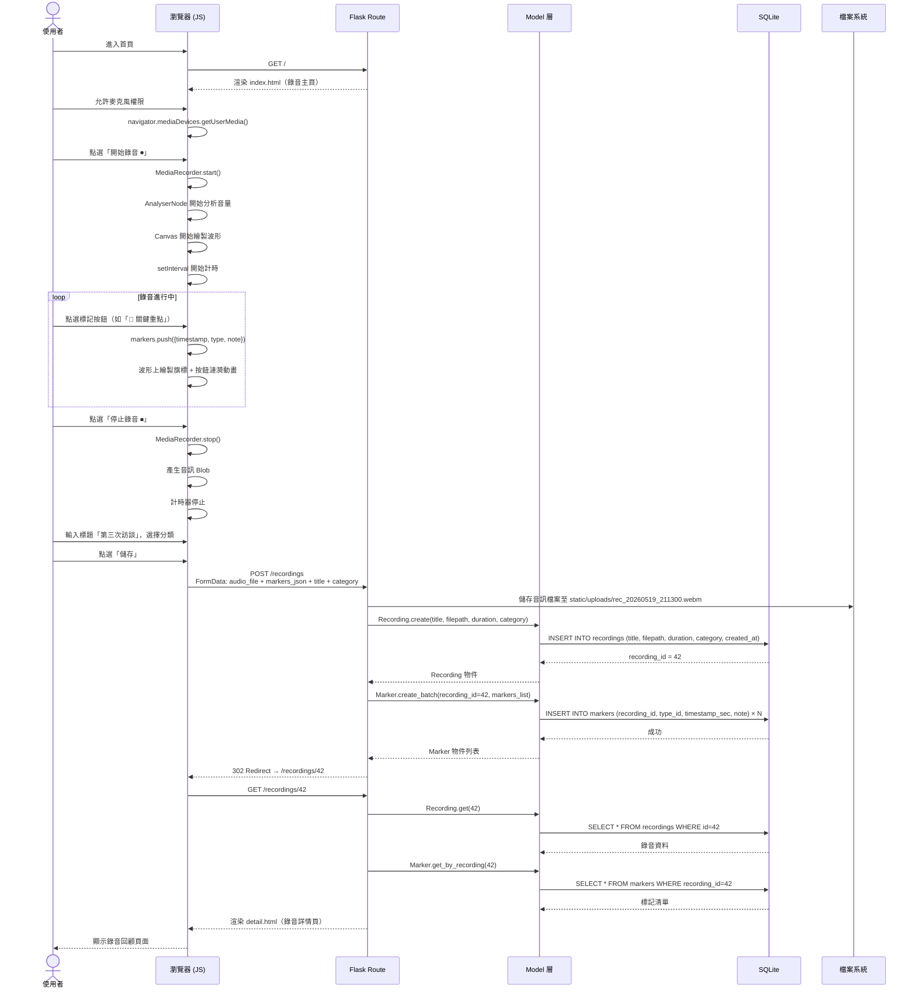
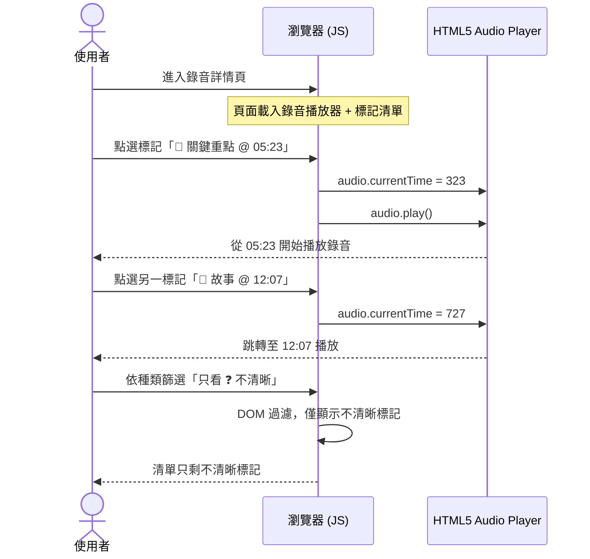
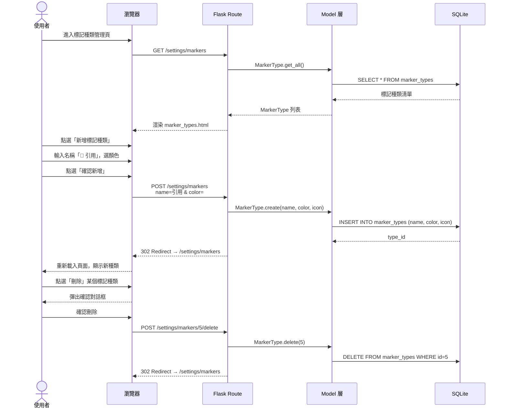
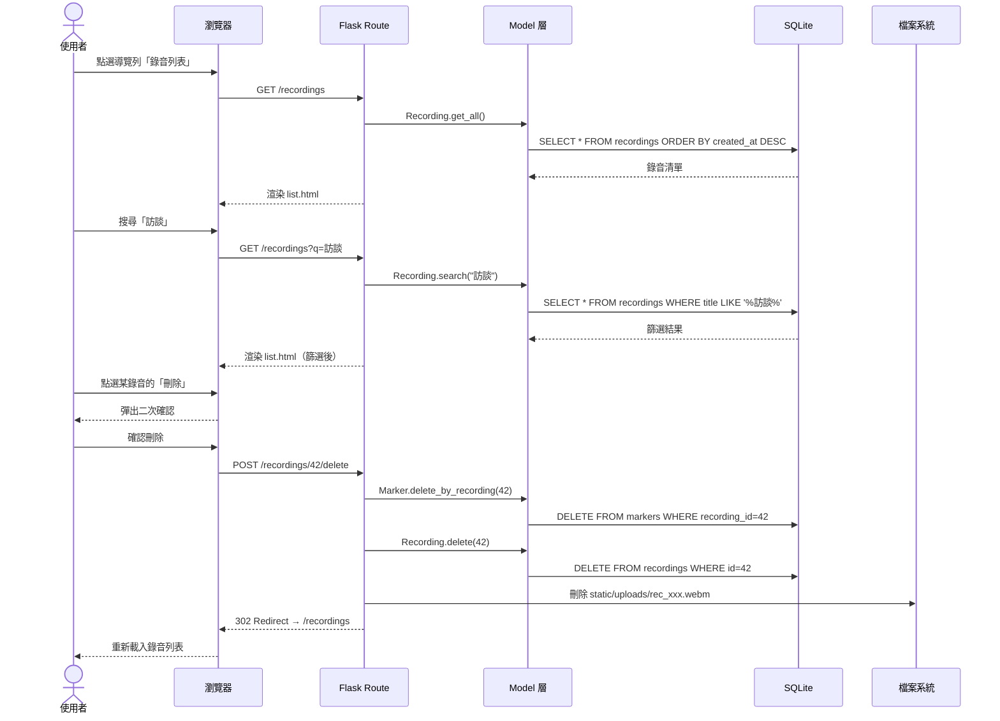
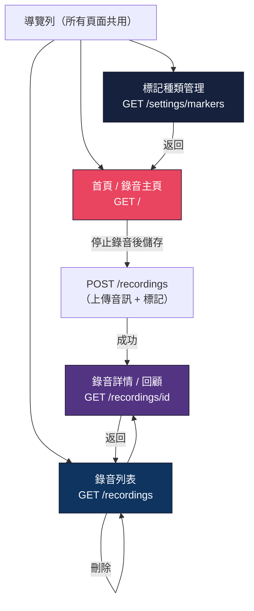

# 流程圖設計 — 即時標記錄音系統

> **文件版本：** v1.0
> **建立日期：** 2026-05-19
> **依據文件：** [PRD.md](PRD.md)、[ARCHITECTURE.md](ARCHITECTURE.md)

---

## 1. 使用者流程圖（User Flow）

### 1.1 整體操作流程

以下流程圖展示使用者從進入系統到完成錄音回顧的完整操作路徑：

### 1.2 錄音核心流程（詳細版）

聚焦於「錄音 + 標記」核心操作的詳細步驟：

---

## 2. 系統序列圖（Sequence Diagram）

### 2.1 核心流程：錄音儲存

描述使用者完成錄音並儲存的完整資料流：

### 2.2 標記跳轉播放

描述使用者在回顧頁面點選標記跳轉到特定時間點的流程：

### 2.3 標記種類管理

描述使用者自訂標記種類的 CRUD 流程：

### 2.4 錄音列表管理

描述使用者瀏覽、搜尋與刪除錄音的流程：

---

## 3. 功能清單對照表

| 功能 | 頁面 | URL 路徑 | HTTP 方法 | 說明 |
|------|------|---------|-----------|------|
| 錄音主頁面 | 首頁 | `/` | `GET` | 顯示錄音介面（波形 + 計時器 + 標記 + 控制按鈕） |
| 儲存錄音 | — | `/recordings` | `POST` | 接收音訊檔案 + 標記 JSON，儲存至資料庫與檔案系統 |
| 錄音列表 | 列表頁 | `/recordings` | `GET` | 顯示所有歷史錄音，支援搜尋 |
| 錄音詳情 | 詳情頁 | `/recordings/<id>` | `GET` | 播放錄音 + 顯示標記清單 + 跳轉回聽 |
| 刪除錄音 | — | `/recordings/<id>/delete` | `POST` | 刪除錄音及其標記（需二次確認） |
| 下載錄音 | — | `/recordings/<id>/download` | `GET` | 下載錄音音訊檔案 |
| 編輯標記 | — | `/markers/<id>` | `POST` | 更新標記備註 |
| 刪除標記 | — | `/markers/<id>/delete` | `POST` | 刪除單一標記 |
| 標記種類列表 | 設定頁 | `/settings/markers` | `GET` | 顯示所有標記種類 |
| 新增標記種類 | — | `/settings/markers` | `POST` | 新增自訂標記種類 |
| 編輯標記種類 | — | `/settings/markers/<id>` | `POST` | 修改標記種類（名稱、顏色、圖示） |
| 刪除標記種類 | — | `/settings/markers/<id>/delete` | `POST` | 刪除標記種類 |
| **API** 錄音列表 | — | `/api/recordings` | `GET` | JSON 格式回傳所有錄音後設資料 |
| **API** 錄音詳情 | — | `/api/recordings/<id>` | `GET` | JSON 格式回傳單一錄音 + 標記資料 |
| **API** 標記列表 | — | `/api/recordings/<id>/markers` | `GET` | JSON 格式回傳該錄音的所有標記 |

---

## 4. 頁面導覽地圖

---

> **下一步：** 流程圖確認後，請進入資料庫設計階段（`/db-design`），定義資料表結構與關聯。
