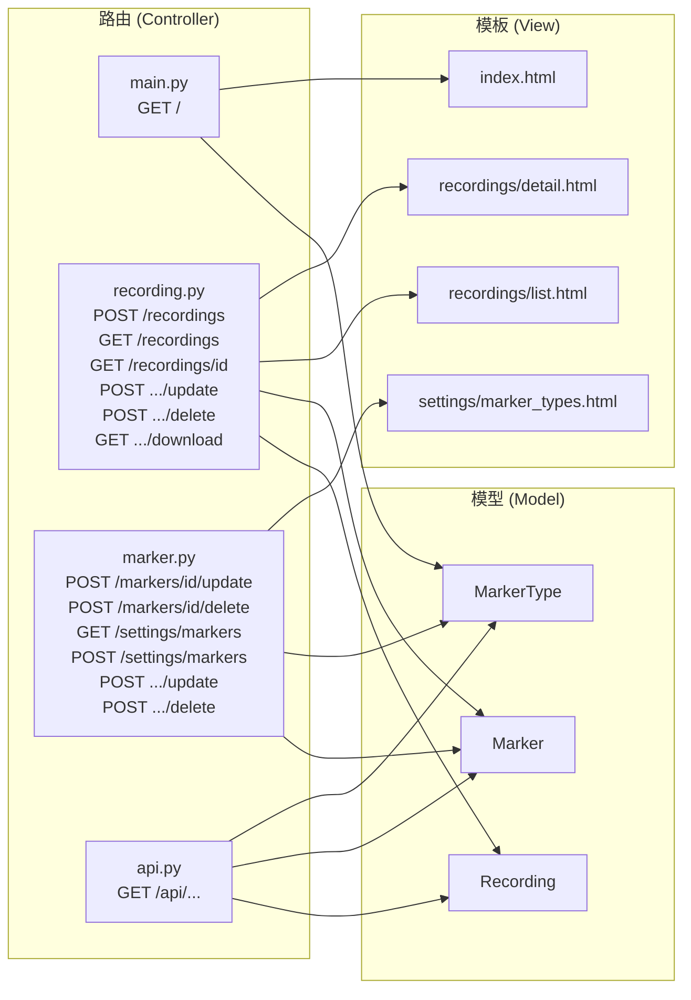

# 路由設計 — 即時標記錄音系統

> **文件版本：** v1.0
> **建立日期：** 2026-05-19
> **依據文件：** [PRD.md](PRD.md)、[ARCHITECTURE.md](ARCHITECTURE.md)、[DB_DESIGN.md](DB_DESIGN.md)

---

## 1. 路由總覽表格

### 1.1 頁面路由

| 功能 | HTTP 方法 | URL 路徑 | 對應模板 | 說明 |
|------|-----------|---------|---------|------|
| 錄音主頁面 | GET | `/` | `templates/index.html` | 錄音核心介面（波形 + 計時器 + 標記 + 控制按鈕） |
| 儲存錄音 | POST | `/recordings` | — | 接收音訊檔案 + 標記 JSON，儲存後重導向至詳情頁 |
| 錄音列表 | GET | `/recordings` | `templates/recordings/list.html` | 顯示所有歷史錄音，支援搜尋 |
| 錄音詳情 | GET | `/recordings/<id>` | `templates/recordings/detail.html` | 播放錄音 + 標記清單 + 跳轉回聽 |
| 更新錄音 | POST | `/recordings/<id>/update` | — | 更新標題 / 分類，重導向至詳情頁 |
| 刪除錄音 | POST | `/recordings/<id>/delete` | — | 刪除錄音與檔案，重導向至列表頁 |
| 下載錄音 | GET | `/recordings/<id>/download` | — | 下載音訊檔案 |
| 更新標記 | POST | `/markers/<id>/update` | — | 更新標記備註，重導向至錄音詳情頁 |
| 刪除標記 | POST | `/markers/<id>/delete` | — | 刪除標記，重導向至錄音詳情頁 |
| 標記種類列表 | GET | `/settings/markers` | `templates/settings/marker_types.html` | 管理標記種類 |
| 新增標記種類 | POST | `/settings/markers` | — | 新增種類，重導向至管理頁 |
| 更新標記種類 | POST | `/settings/markers/<id>/update` | — | 更新種類，重導向至管理頁 |
| 刪除標記種類 | POST | `/settings/markers/<id>/delete` | — | 刪除種類，重導向至管理頁 |

### 1.2 API 路由（JSON 回傳，供系統整合）

| 功能 | HTTP 方法 | URL 路徑 | 說明 |
|------|-----------|---------|------|
| 錄音列表 API | GET | `/api/recordings` | JSON 回傳所有錄音後設資料 |
| 錄音詳情 API | GET | `/api/recordings/<id>` | JSON 回傳單一錄音 + 標記 |
| 標記列表 API | GET | `/api/recordings/<id>/markers` | JSON 回傳該錄音的所有標記 |
| 標記種類 API | GET | `/api/marker-types` | JSON 回傳所有標記種類 |

---

## 2. 每個路由的詳細說明

### 2.1 main Blueprint（`app/routes/main.py`）

#### `GET /` — 錄音主頁面

- **輸入：** 無
- **處理邏輯：**
  1. `MarkerType.get_all()` 取得所有標記種類
  2. 渲染 `index.html`，傳入標記種類清單
- **輸出：** 渲染 `templates/index.html`
- **錯誤處理：** 無特殊處理

---

### 2.2 recording Blueprint（`app/routes/recording.py`）

#### `POST /recordings` — 儲存錄音

- **輸入：**
  - `request.files['audio_file']` — 音訊檔案（WebM/WAV）
  - `request.form['title']` — 錄音標題
  - `request.form['duration_sec']` — 時長（秒）
  - `request.form['category']` — 分類（可選）
  - `request.form['markers_json']` — 標記 JSON 陣列字串
- **處理邏輯：**
  1. 驗證必填欄位
  2. 儲存音訊檔案至 `static/uploads/`（生成唯一檔名）
  3. `Recording.create(title, filepath, duration_sec, category)`
  4. 解析 `markers_json`，`Marker.create_batch(recording_id, markers_list)`
- **輸出：** 重導向至 `/recordings/<id>`
- **錯誤處理：** 缺少必填欄位 → 回傳 400；檔案儲存失敗 → 回傳 500

#### `GET /recordings` — 錄音列表

- **輸入：** `request.args.get('q')` — 搜尋關鍵字（可選）
- **處理邏輯：**
  1. 若有搜尋字串 → `Recording.search(q)`
  2. 否則 → `Recording.get_all()`
  3. 為每筆錄音取得標記數量 `Recording.get_marker_count(id)`
- **輸出：** 渲染 `templates/recordings/list.html`
- **錯誤處理：** 無特殊處理

#### `GET /recordings/<id>` — 錄音詳情

- **輸入：** URL 參數 `id`（錄音 ID）
- **處理邏輯：**
  1. `Recording.get_by_id(id)`
  2. `Marker.get_by_recording(id)`
  3. `MarkerType.get_all()`（用於標記種類名稱/圖示顯示）
- **輸出：** 渲染 `templates/recordings/detail.html`
- **錯誤處理：** 找不到錄音 → 404

#### `POST /recordings/<id>/update` — 更新錄音

- **輸入：**
  - URL 參數 `id`
  - `request.form['title']` — 新標題
  - `request.form['category']` — 新分類
- **處理邏輯：** `Recording.update(id, title, category)`
- **輸出：** 重導向至 `/recordings/<id>`
- **錯誤處理：** 找不到錄音 → 404

#### `POST /recordings/<id>/delete` — 刪除錄音

- **輸入：** URL 參數 `id`
- **處理邏輯：**
  1. `Recording.get_by_id(id)` 取得檔案路徑
  2. 刪除音訊檔案
  3. `Recording.delete(id)`（標記因 CASCADE 自動刪除）
- **輸出：** 重導向至 `/recordings`
- **錯誤處理：** 找不到錄音 → 404

#### `GET /recordings/<id>/download` — 下載錄音

- **輸入：** URL 參數 `id`
- **處理邏輯：** `Recording.get_by_id(id)`，回傳檔案
- **輸出：** `send_file()` 下載音訊檔案
- **錯誤處理：** 找不到錄音或檔案 → 404

---

### 2.3 marker Blueprint（`app/routes/marker.py`）

#### `POST /markers/<id>/update` — 更新標記備註

- **輸入：**
  - URL 參數 `id`（標記 ID）
  - `request.form['note']` — 新備註
- **處理邏輯：** `Marker.update(id, note)`
- **輸出：** 重導向至 `/recordings/<recording_id>`
- **錯誤處理：** 找不到標記 → 404

#### `POST /markers/<id>/delete` — 刪除標記

- **輸入：** URL 參數 `id`（標記 ID）
- **處理邏輯：**
  1. `Marker.get_by_id(id)` 取得 `recording_id`
  2. `Marker.delete(id)`
- **輸出：** 重導向至 `/recordings/<recording_id>`
- **錯誤處理：** 找不到標記 → 404

---

### 2.4 settings（標記種類管理，整合在 marker Blueprint）

#### `GET /settings/markers` — 標記種類列表

- **輸入：** 無
- **處理邏輯：**
  1. `MarkerType.get_all()`
  2. 為每個種類取得 `MarkerType.get_usage_count(id)`
- **輸出：** 渲染 `templates/settings/marker_types.html`

#### `POST /settings/markers` — 新增標記種類

- **輸入：**
  - `request.form['name']` — 種類名稱
  - `request.form['color']` — 顏色 HEX
  - `request.form['icon']` — 圖示 Emoji
- **處理邏輯：** `MarkerType.create(name, color, icon)`
- **輸出：** 重導向至 `/settings/markers`

#### `POST /settings/markers/<id>/update` — 更新標記種類

- **輸入：**
  - URL 參數 `id`
  - `request.form['name']`、`request.form['color']`、`request.form['icon']`
- **處理邏輯：** `MarkerType.update(id, name, color, icon)`
- **輸出：** 重導向至 `/settings/markers`
- **錯誤處理：** 找不到種類 → 404

#### `POST /settings/markers/<id>/delete` — 刪除標記種類

- **輸入：** URL 參數 `id`
- **處理邏輯：** `MarkerType.delete(id)`
- **輸出：** 重導向至 `/settings/markers`
- **錯誤處理：** 找不到種類 → 404；仍有標記引用 → 顯示錯誤訊息

---

### 2.5 api Blueprint（`app/routes/api.py`）

#### `GET /api/recordings` — 錄音列表 API

- **輸出：** `{ "recordings": [ {...}, ... ] }`

#### `GET /api/recordings/<id>` — 錄音詳情 API

- **輸出：** `{ "recording": {...}, "markers": [{...}, ...] }`

#### `GET /api/recordings/<id>/markers` — 標記列表 API

- **輸出：** `{ "markers": [ {...}, ... ] }`

#### `GET /api/marker-types` — 標記種類 API

- **輸出：** `{ "marker_types": [ {...}, ... ] }`

---

## 3. Jinja2 模板清單

所有模板皆繼承 `base.html` 基礎模板。

| 模板路徑 | 繼承 | 說明 |
|---------|------|------|
| `templates/base.html` | — | 基礎模板：HTML 骨架、導覽列、CSS/JS 引入 |
| `templates/index.html` | `base.html` | 錄音主頁面：波形 + 計時器 + 標記按鈕 + 控制按鈕 |
| `templates/recordings/list.html` | `base.html` | 錄音列表：搜尋 + 錄音卡片 |
| `templates/recordings/detail.html` | `base.html` | 錄音詳情：播放器 + 標記清單 + 編輯表單 |
| `templates/settings/marker_types.html` | `base.html` | 標記種類管理：新增 / 編輯 / 刪除表單 |

### `base.html` 結構

```
<!DOCTYPE html>
├── <head>
│   ├── meta charset / viewport
│   ├── <title> - 即時標記錄音系統</title>
│   ├── <link> style.css
│   └── 
├── <body>
│   ├── <nav> 導覽列
│   │   ├── 品牌標誌 / 系統名稱
│   │   ├── 首頁（錄音）連結
│   │   ├── 錄音列表連結
│   │   └── 標記種類設定連結
│   ├── <main> 
│   ├── <script> 共用 JS（如有）
│   └── 
```

---

## 4. 路由 — 模板 — Model 對照圖



---

> **下一步：** 路由設計確認後，可根據路由表進行團隊分工，然後進入程式碼實作階段（`/implementation`）。
